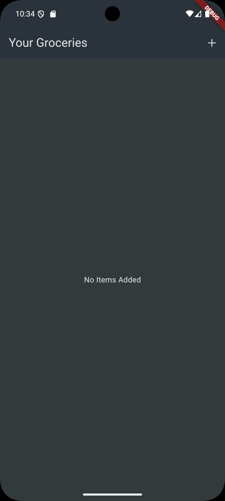
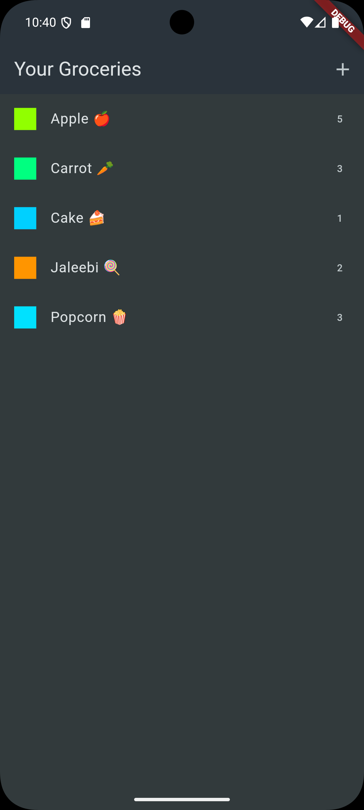
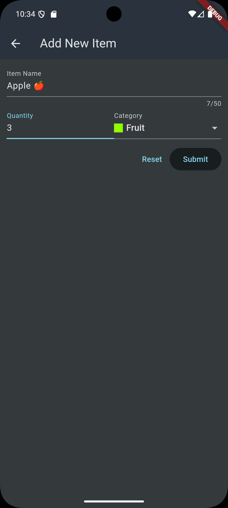

# Introduction
ShopCart is an easy to use Mobile App, supporting iOS and Android devices. You can easily add items you want to buy, next time you are in a store, so you dont forget.
Adding Items takes only 2 clicks, and the Item will be stored on our database as well.

## ScreenShots
 &nbsp; 
 &nbsp; 

